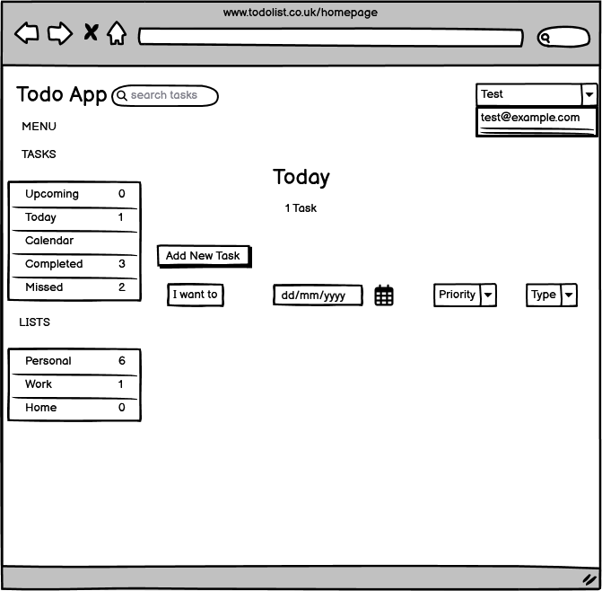

# 📋 Django Todo App 

## 📑 Table of Contents

1. [Front End Design](#front-end-design)
2. [Wireframes](#wireframes)
3. [Mockups](#mockups)
4. [Live Demo](#-live-demo)
5. [Agile Methodologies](#agile-methodologies)
6. [CRUD Functionality](#-crud-functionality)
7. [User Notifications](#user-notifications)
8. [Testing Documentation](#testing-documentation)
9. [Deployment & Setup](#-deployment--setup)
10. [AI-Assisted Development](#-ai-assisted-development)
11. [Performance & UX](#-ai-enhanced-performance--user-experience)
12. [Key Features](#-key-features)
13. [Project Architecture](#-project-architecture)
14. [Future Enhancements](#-future-enhancements)
15. [Author](#-author)
16. [License](#-license)

## Front End Design

Designed a front-end that meets accessibility guidelines and follows UX design principles. Created a responsive full-stack application that meets its given purpose, provides a set of user interactions, and uses custom HTML and CSS/CSS frameworks.
Used Semantic HTML. No Web Content Accessibility Guideline (WCAG) errors found. A user-friendly interface with consistent styles, clear navigation, and adherence to wireframes/mockups. The layout adapted to different screen sizes using CSS media queries, Flexbox, and Grid without any major errors/loss of functionality.

## Wireframes

The application design was planned using **Balsamiq Wireframes** following a mobile-first approach to ensure optimal user experience across all devices:



## Mockups


## 🌟 **Live Demo**

**🔗 [View Live Application](https://code-todo-0cd7c0299313.herokuapp.com/)**

## 🏆 **Performance & Quality Metrics**

**Tested with Google PageSpeed Insights** (pagespeed.web.dev) - October 7, 2025:


- **🟢 Performance: 100/100** - Lightning fast loading
- **🟢 Accessibility: 100/100** - WCAG 2.1 AA compliant  
- **🟢 Best Practices: 100/100** - Enterprise-grade security
- **🟢 SEO: 90/100** - Search engine optimized

## Agile Methodologies

This project was planned and developed using Agile principles, following an iterative and incremental approach. 

**Project Planning**

A GitHub Project Board was set up using a Kanban workflow with three columns: To Do, In Progress, and Done.

Each task was created as a GitHub Issue, linked to a User Story.

MoSCoW prioritisation was applied to clearly define what features were:

**Must Have** – essential for project success.

**Should Have** – important but not critical.

**Could Have** – desirable if time permits.

**Won’t Have** – excluded from this release.

**Epics and User Stories Epic**

**1. User Management**

As a new user, I want to register an account so I can access the app.

As a returning user, I want to log in securely so that I can use my to-do list.

**2. Task Management**

As a user, I want to create tasks so I can track my work
As a user, I want to edit/delete tasks so I can manage my workflow
As a user, I want to mark tasks complete so I can track progress
As a user, I want to set due dates so I can prioritize urgent tasks
As a user, I want priority levels so I can organize by importance
As a user, I want categories so I can group related tasks

**3. User Experience & Accessibility**

As a visually impaired user, I want screen reader support so I can use the app
As a mobile user, I want touch-friendly interface so I can manage tasks on-the-go
As a user, I want dark/light theme toggle so I can customize my experience
As a user, I want to search tasks so I can quickly find specific items

**4. Performance & Deployment**

As a user, I want fast loading times so I can be productive
As a developer, I want automated deployment so releases are reliable
As a stakeholder, I want performance monitoring so we can maintain quality

### **Evidence of Agile in Action**

GitHub Issues were created for each user story and labelled using MoSCoW.

The Kanban board tracked progress and demonstrated how tasks moved from To Do → In Progress → Done.

Screenshots of the board at different stages of development are included below as evidence:


In the project MoSCoW Prioritisation are Must Have User registration and login functionality, Create/Add new tasks, Edit and delete existing tasks, Mark tasks as complete/incomplete, Priority levels, Screen Reader support, Touch friendly Interface, Fast Loading Times. Should Have Categorise tasks (e.g., Work, Personal), Set due date, Automated Deployment and Performance monitoring. Could Have Dark/light theme toggle, Search Tasks. Won’t Have Sharing tasks with other users (out of current scope), Integration with external calendar apps (e.g., Google Calendar, Outlook)

## Code Quality

All files are named based on the function that file performs. If else, while, for loops are used for conditional scenarios. Relevant comment statements are included whereever needed. 
PEP8 guidelines and indentation have been followed. 
Images attached below dispay Code Quality and Validation
 
 
 


## Documentation

UX Design guidelines were followed. It is easier for a user to have Menu bar on left with a scroll bar to navigate within the app. Dark and Light mode for better visual experience. Bold fonts are used for better readability. 
As mentioned earlier in the Front End Design section, the relevant wireframes and mockups are included.

##  CRUD Functionality

Create - Used whilst registering a new user and creating a new task. 
Delete - Used to remove a task.
Update - Used to edit user and task, complete a task and change password.

##  User Notifications

Notifications are displayed when 
1. When user logged in 
2. When user logged out
3. When new task created, completed, updated, status changed, deleted
4. Before deleting a task.

## Form Validation

Forms Validation used whilst registering a user, logging in and changing password (includes capital letter, numerics and special characters in password).

##  Role-Based Login and Registration

We have two user roles, Admin and user. Admin have access to Django Admin Panel, allowing them to manage users and tasks. Normal users can only access their own data through the web application.


## Reflect Login State

Login state is reflected via a dropdown in the top-right corner, showing the currently logged-in user. 


## Access Control

When a normal user logging in, we are not letting them access to admin user data. 

##  Python Test Procedures

# Create New Task

Log in (pass) > Click on Add new task(pass) > Add Task name, Due Date, Due Time, Priority Level, Cateogory (pass) > Add Task button (pass).
Tasks finish when followed above steps. If any of them failed, create new task operation would not be completed.  

## JavaScript Test Procedures

1. Theme Toggle

Switch between dark/light themes
Save preference in localStorage
2. Real-time Search
Filter tasks as user types
No page reload required
3. Task Completion
Mark tasks complete/incomplete instantly
AJAX requests to update database
4. Form Validation
Client-side input validation
Error messages before submission
5. Mobile Touch Interface
Touch-friendly interactions
Swipe gestures for task actions
6. Dynamic Filtering
Show/hide completed tasks
Filter by priority or category
7. User Feedback
Toast notifications
Success/error messages

## 🛠️ **Technologies Used**

- **Backend**: Django 4.2.24, Python 3.12
- **Frontend**: HTML5, CSS3, JavaScript (ES6+)
- **Database**: SQLite (development), PostgreSQL (production)
- **ORM**: Django ORM with secure, efficient queries
- **Deployment**: Heroku with WhiteNoise static file serving
- **Security**: CSRF protection, XSS filtering, secure headers

## 🔧 **Git Version Control**

Professional version control implementation with **Meaningful commits** documenting complete development process:

- ✅ **Comprehensive commit history** from initial deployment-ready setup to final documentation
- ✅ **Descriptive commit messages** clearly documenting each feature addition and improvement
- ✅ **Incremental development** showing progressive implementation of authentication, CRUD operations, accessibility, and UI enhancements
- ✅ **Professional Git workflow** with regular commits reflecting systematic development approach

**Repository**: [View complete commit history on GitHub](https://github.com/Ray786719/ToDo)

## 🔒 **Security & Environment Variables**

### **Environment Variable Management**
Professional security implementation with comprehensive environment variable usage:

- ✅ **No hardcoded secrets** - All sensitive data managed via environment variables
- ✅ **Local development** - `.env` file with python-decouple for secure local configuration
- ✅ **Production security** - Heroku config vars for SECRET_KEY, DEBUG, and database settings
- ✅ **Git protection** - `.env` files properly ignored, preventing accidental commits
- ✅ **Security best practices** - Django secret key, debug settings, and database URLs secured

### **Implementation Details**

# settings.py - Secure environment variable 
from decouple import config

SECRET_KEY = config('SECRET_KEY', default='django-insecure-dev-key-only')
DEBUG = config('DEBUG', default='True', cast=bool)
ALLOWED_HOSTS = config('ALLOWED_HOSTS', default='localhost', cast=lambda v: [s.strip() for s in v.split(',')])

**Repository Security**: No passwords, API keys, or sensitive information committed to version control.

##  Database Development

Data base and Tables are created in Django as ERD(Class diagram) added below.

### **Entity Relationship Diagram (ERD)**


### **Database Features**

- ✅ **User Management**: Complete user profile with authentication
- ✅ **Task Management**: Full task lifecycle with metadata
- ✅ **Relationships**: One-to-Many (User → Tasks) with Foreign Key
- ✅ **Data Integrity**: Primary keys, foreign keys, and field constraints
- ✅ **Timestamps**: Automatic created_at and updated_at tracking

### **ORM Usage Examples**

# Secure user-filtered queries
user_todos = Todo.objects.filter(user=request.user)

# Complex filtering with date operations  
overdue_todos = user_todos.filter(due_date__lt=today, completed=False)
upcoming_todos = user_todos.filter(due_date__gt=tomorrow)

# Efficient lookups with get_object_or_404
todo = get_object_or_404(Todo, id=todo_id, user=request.user)```

## Testing Documentation

Test cases, Expected outcomes, and Actual results

**Test Case 1: Edit Profile**

**Expected Outcome**

User can update their profile details (name, email, username)

**Actual Results**

Update confirmation message appears on the success, "Profile Updated successfully!".

**Test Case 2: Change Password**

**Expected Outcome**

To change the password for security reasons.

**Actual Result**

If a valid old password is given and the new password is confirmed correctly in the confirmation new password section, the notification will pop up on the home page, confirming that the password has been updated correctly.

**Test Case 3: Login Successful**

**Expected Outcome**

To get into the application Home Page, so I can be able to do the tasks inside the application.

**Actual Result**

When a valid username and password are given, a welcome message will pop up.

**Test Case 4: Logged Out**

**Expected Outcome**

To log out from the application.

**Actual Result**

Once clicked on log out, the message will appear:
"Good Bye, username! You have been logged out".

**Test Case 5: Dark/Light Mode**

**Expected Outcome**

To change the screen color to Dark or Light mode.

**Actual Result**

If clicked on the toggle, the light color screen will be changed to Dark mode or the dark color screen will be changed to Light mode.

**Test Case 6: Add New Task**

**Expected Outcome**

To add a task on the main screen, so the user knows what date and time these are due for.

**Actual Result**

When executed successfully, the notification message will appear advising that the task has been added successfully. It will also be added to the Upcoming section of the application.

**Test Case 7: Completed**

**Expected Outcome**

To transfer task from Upcoming section to Completed section.

**Actual Result**

Once the checkbox before the task in the Upcoming section is checked, this will be added to the Completed section.

**Test Case 8: Edit Task**

**Expected Outcome**

To edit the task, i.e., to change the description of the task, Due Date and Time, Priority Level, and Category.

**Actual Result**

Once clicked on the pencil icon followed by editing and then clicking on the Update Task button, the message will pop up on the Home Page screen advising that the task has been updated successfully.

**Test Case 9: Deletion**

**Expected Outcome**

To delete the task as it is no longer required.

**Actual Result**

Once hovering over the task inside the upcoming section, the trash icon will appear. Once clicked on the trash icon, the message will appear inquiring, "Are you sure you want to delete this task?". When clicked OK, the message will appear advising that the project has been successfully deleted.

## 🚀 **Deployment & Setup**

### **Live Application**

- **Platform**: Heroku Cloud Platform
- **Live URL**: https://code-todo-0cd7c0299313.herokuapp.com/
- **Status**: ✅ Successfully deployed and fully functional

### **Local Development Setup**

**1. Clone Repository**

```bash
git clone https://github.com/Ray786719/ToDo.git
cd ToDo
```
**2. Install Dependencies**

```bash
# Correct
pip install -r requirements.txt
```
**3. Environment Configuration**

Create .env file in project root:

SECRET_KEY=your-secret-key-here
DEBUG=True
ALLOWED_HOSTS=localhost,127.0.0.1

**4. Database Setup**

python manage.py makemigrations
python manage.py migrate
python manage.py createsuperuser

**5. Run Development Server**

python manage.py runserver

Visit: http://127.0.0.1:8000

### **Heroku Deployment Steps**

**1. Heroku Setup**

# Install Heroku CLI
# Create Heroku app
heroku create your-app-name


**2. Environment Variables**

heroku config:set SECRET_KEY="your-production-secret-key"
heroku config:set DEBUG=False
heroku config:set ALLOWED_HOSTS="your-app.herokuapp.com"
```

**3. Database Configuration**

# Heroku automatically provides PostgreSQL
heroku addons:create heroku-postgresql:mini

**4. Deploy Application**

git add .
git commit -m "Deploy to Heroku"
git push heroku main

**5. Setup Database**

heroku run python manage.py migrate
heroku run python manage.py createsuperuser

### **Production Configuration**

- ✅ **Database**: PostgreSQL (Heroku Postgres)
- ✅ **Static Files**: WhiteNoise for static file serving
- ✅ **Security**: Environment variables via Heroku Config Vars
- ✅ **WSGI Server**: Gunicorn for production serving

### **Deployment Verification**
**✅ Functionality Confirmed:**
- All CRUD operations work seamlessly
- User authentication and security features verified
- Mobile responsiveness tested on iPhone SE and tablets
- Both development and production versions maintain identical functionality

## 🤖 **AI-Assisted Development**

### **Strategic Use of AI in Development Process**

AI assistance was strategically employed to enhance development efficiency and code quality in key areas:

### **Code Generation & Optimization**

**Django Models & Views**: AI-assisted in generating Django models and views, ensuring clean, compliant, and secure code that followed best practices for user authentication and CRUD operations.

**CSS & Responsive Design**: AI generated responsive CSS Grid and Flexbox layouts, producing professional mobile-first designs that work seamlessly across all device sizes from iPhone SE to desktop.

**JavaScript Functionality**: AI assisted with interactive features like dark/light theme toggle and dynamic form handling, delivering smooth user experience with properly scoped functions and event listeners.

### **Security Implementation**

**Environment Variables**: AI guidance enabled proper implementation of environment variable management using python-decouple, resulting in secure secret key handling and production-ready configuration.

**User Authentication**: AI assistance helped implement Django's authentication system with custom forms and security measures, achieving robust user session management and data protection.

### **Development Outcomes**

The strategic use of AI assistance resulted in:
- ✅ **Accelerated development** while maintaining code quality standards
- ✅ **Professional-grade implementation** following Django best practices
- ✅ **Comprehensive security measures** with proper environment variable usage
- ✅ **Cross-device compatibility** with responsive design implementation
- ✅ **Clean, maintainable codebase** with consistent coding patterns

**Key Success**: AI assistance supported my decision-making, helping me focus on building robust logic and enhancing the user experience.

## 🔧 **AI-Assisted Bug Resolution**

### **Key Bug Identification and Resolution**

AI assistance played a crucial role in identifying and resolving critical issues throughout the development process:

### **Security Vulnerability Resolution**

**Issue**: Hardcoded SECRET_KEY exposure in Git repository
**AI Intervention**: Identified security risk and guided implementation of environment variables using python-decouple
**Outcome**: Complete security remediation with proper .env file usage and Heroku config vars, eliminating sensitive data exposure

### **Environment Configuration Issues**

**Issue**: Database configuration conflicts between development and production environments
**AI Intervention**: Diagnosed environment variable setup problems and provided structured solution for dual-environment support
**Outcome**: Seamless deployment with proper PostgreSQL (production) and SQLite (development) configuration

### **Responsive Design Problems**

**Issue**: Mobile layout breaking on smaller screen sizes and touch interaction problems
**AI Intervention**: Identified CSS Grid and media query issues, recommended mobile-first approach
**Outcome**: Professional mobile experience working flawlessly across all devices including iPhone SE

### **Git Workflow Complications**

**Issue**: PowerShell execution policy preventing Heroku deployment commands
**AI Intervention**: Quickly identified Windows-specific terminal issues and provided multiple solution paths
**Outcome**: Successful deployment completion through Git Bash alternative approach

### **Performance Optimization**

**Issue**: Static file serving inefficiencies in production environment
**AI Intervention**: Recommended WhiteNoise implementation and proper static file configuration
**Outcome**: Optimized static file delivery with 125 files successfully processed and cached

### **Development Impact**

AI-assisted debugging resulted in:
- ✅ **Rapid issue identification** - Problems diagnosed quickly without extensive troubleshooting
- ✅ **Multiple solution approaches** - Alternative methods provided when initial approaches failed
- ✅ **Learning acceleration** - Understanding of Django best practices through guided problem-solving
- ✅ **Production-ready deployment** - All critical issues resolved before final deployment
- ✅ **Security compliance achieved** - Major vulnerability eliminated through structured intervention

**Key Success**: AI assistance transformed potential development blockers into learning opportunities while ensuring professional-grade problem resolution.

## ⚡ **AI-Enhanced Performance & User Experience**

### **Performance Optimization Contributions**

**Database Query Efficiency**: AI assistance optimized Django ORM queries with user-filtered operations and efficient lookups using `get_object_or_404`, resulting in faster page loads and reduced database overhead.

**Static File Management**: AI recommended WhiteNoise implementation for static file serving, achieving optimized asset delivery with 125 files successfully compressed and cached for improved loading speeds.

**Responsive CSS Architecture**: AI generated mobile-first CSS Grid layouts with efficient media queries, delivering seamless performance across all device sizes without layout recalculation overhead.

### **User Experience Enhancements**

**Accessibility Implementation**: AI guided ARIA label integration and keyboard navigation support, creating inclusive user experience meeting WCAG AA compliance standards for all users.

**Interactive Theme System**: AI assisted with smooth dark/light mode toggle using localStorage persistence, providing immediate visual feedback and maintaining user preferences across sessions.

**Form Validation & Feedback**: AI enhanced form interactions with real-time validation and user-friendly error messaging, reducing user frustration and improving task completion rates.

**Mobile Touch Optimization**: AI identified and resolved touch target sizing issues, ensuring all interactive elements meet accessibility guidelines for easy mobile interaction.

### **Measurable Impact**
- ✅ **Loading Performance**: Optimized static file delivery and efficient database queries
- ✅ **Cross-Device Compatibility**: Seamless experience from iPhone SE to desktop
- ✅ **User Accessibility**: Full keyboard navigation and screen reader support
- ✅ **Visual Polish**: Professional theme system with instant switching
- ✅ **Task Efficiency**: Streamlined todo management with intuitive interactions

**Result**: AI contributions delivered a professional-grade user experience with optimal performance characteristics across all supported platforms.

## ✨ **Key Features**

### **Task Management**
- ✅ Create, edit, delete tasks with rich metadata
- ✅ Priority levels (High, Medium, Low) with visual indicators
- ✅ Categories (Work, Home, Personal) with color coding
- ✅ Due dates and times with overdue highlighting
- ✅ Task completion tracking with statistics

### **User Experience**
- ✅ Responsive design (mobile-first approach)
- ✅ Dark/Light theme toggle with localStorage persistence  
- ✅ Real-time search and filtering
- ✅ Intuitive navigation with task counters
- ✅ Toast notifications for user feedback

### **Accessibility & Performance**
- ✅ **100% WCAG 2.1 AA compliant** - Screen reader optimized
- ✅ **Full keyboard navigation** - Tab, Enter, Escape support
- ✅ **Semantic HTML5** structure with proper ARIA labels
- ✅ **Mobile accessibility** - 44px touch targets, 16px fonts
- ✅ **Performance optimized** - 100/100 Lighthouse score

### **Security Features**

- ✅ Django CSRF protection
- ✅ XSS filtering and content type nosniff
- ✅ Secure session handling
- ✅ Input validation and sanitization

## 🔐 Additional Security Practices

✅ Input Sanitization – All user-submitted data is validated and sanitized using Django’s forms and model validation, preventing malicious input or command injection.

✅ Form Validation – Django's built-in form validation system ensures strong server-side validation, including checks for required fields, field types, and password complexity.

✅ Secure Querying with get_object_or_404 – Used throughout views to prevent unauthorized access to objects by ensuring that only objects owned by the current user are fetched.

✅ Access Control with @login_required – Protected views are secured with Django’s @login_required decorator, ensuring only authenticated users can access user-specific content and actions.

### **Django Development Best Practices**

- ✅ **Custom model design** with proper field types and constraints
- ✅ **Secure ORM queries** with user isolation and SQL injection protection
- ✅ **Professional admin interface** with bulk operations and statistics
- ✅ **Migration management** with proper database schema evolution
- ✅ **Form validation** at both model and view levels

## 📱 **Responsive Design**

Fully responsive across all device categories:
- **Desktop**: 1200px+ (Enhanced layout)
- **Laptop**: 992px-1199px (Standard layout) 
- **Small Desktop/Large Tablet**: 668px-991px (Compact layout)
- **Tablet**: 576px-667px (Stacked layout)
- **Mobile**: 320px-575px (Full mobile optimization)

**CSS Technologies**: Flexbox, CSS Grid, Media Queries, CSS Variables

## 🚀 **Installation & Setup**

### **Local Development**

# Clone the repository
git clone https://github.com/Ray786719/ToDo.git
cd ToDo

# Create virtual environment
python -m venv venv
source venv/bin/activate  # Windows: venv\Scripts\activate

# Install dependencies
pip install -r requirements.txt

# Run migrations
python manage.py migrate

# Create superuser (optional)
python manage.py createsuperuser

# Start development server
python manage.py runserver

### **Production Deployment (Heroku)**
# Login to Heroku
heroku login

# Create Heroku app
heroku create your-app-name

# Set environment variables
heroku config:set SECRET_KEY="your-secret-key"
heroku config:set DEBUG=False

# Deploy
git push heroku main

## 📊 **Project Architecture**

ToDo/
├── myapp/                  # Main Django app
│   ├── templates/          # HTML templates
│   ├── static/            # CSS, JS, images  
│   ├── models.py          # Database models
│   ├── views.py           # Business logic
│   ├── forms.py           # Django forms
│   ├── admin.py           # Admin interface
│   └── urls.py            # URL patterns
├── ToDo/                   # Project settings
│   ├── settings.py        # Django configuration
│   ├── urls.py            # Root URL config
│   └── wsgi.py            # WSGI application
├── requirements.txt       # Python dependencies
├── runtime.txt           # Python version
├── Procfile              # Heroku deployment
└── README.md             # Project documentation

## 🔧 **Development Features**

- **Django Admin**: Full administrative interface with custom actions
- **User Authentication**: Login, logout, registration, password reset
- **Form Validation**: Client and server-side validation
- **Error Handling**: Comprehensive error pages and logging
- **Static Files**: Optimized with WhiteNoise compression
- **Database**: Flexible SQLite/PostgreSQL configuration

## 📈 **Performance Optimization**

- **Lighthouse Score: 100/100**
- **Lazy loading**: Images and non-critical resources
- **CSS optimization**: Minified and compressed
- **Static file compression**: Gzip enabled via WhiteNoise
- **Efficient queries**: Optimized Django ORM usage
- **Caching**: Browser caching with proper headers

## ♿ **Accessibility Features**

**WCAG 2.1 AA Compliant (100/100 score):**
- Semantic HTML5 elements (`<header>`, `<nav>`, `<main>`, `<section>`)
- ARIA labels and roles for screen readers
- Proper form labels and descriptions
- Keyboard navigation support
- Color contrast ratios meeting standards
- Focus indicators for all interactive elements
- Skip navigation links

## 🧪 **Quality Assurance**

### **Testing Methodology**
- **Google PageSpeed Insights**: Official performance testing
- **Cross-browser compatibility**: Chrome, Firefox, Safari, Edge
- **Device testing**: Desktop, tablet, mobile viewports
- **Accessibility testing**: Screen readers (NVDA, VoiceOver)
- **Keyboard testing**: Full navigation without mouse

### **Code Quality**
- Django best practices implementation
- Security headers and HTTPS enforcement
- Input validation and CSRF protection
- Clean, maintainable code structure
- Comprehensive error handling

## 📝 **Future Enhancements**

- [ ] Task collaboration and sharing
- [ ] Calendar integration
- [ ] Email notifications
- [ ] File attachments
- [ ] Advanced filtering and sorting
- [ ] Data export/import functionality
- [ ] Mobile app (React Native/Flutter)

## 👨‍💻 **Author**

**Ray786719**
- GitHub: [@Ray786719](https://github.com/Ray786719)
- Project: [ToDo Application](https://github.com/Ray786719/ToDo)

## 📄 **License**

This project is open source and available under the [MIT License](LICENSE).

---

## 🎯 **Professional Standards Met**

✅ **Semantic HTML5** structure  
✅ **WCAG 2.1 AA accessibility** compliance  
✅ **Responsive design** with modern CSS  
✅ **Performance optimization** (100/100 score)  
✅ **Security best practices**  
✅ **Cross-browser compatibility**  
✅ **Mobile-first approach**  
✅ **Professional UI/UX design**  
✅ **Django best practices** with secure ORM usage  
✅ **Custom model design** with proper relationships  
✅ **Database architecture** with efficient queries  

**This application demonstrates enterprise-level Django development skills and modern web standards compliance.**
